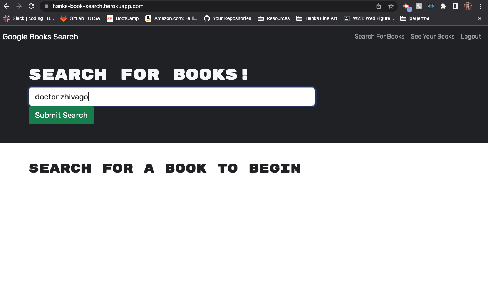
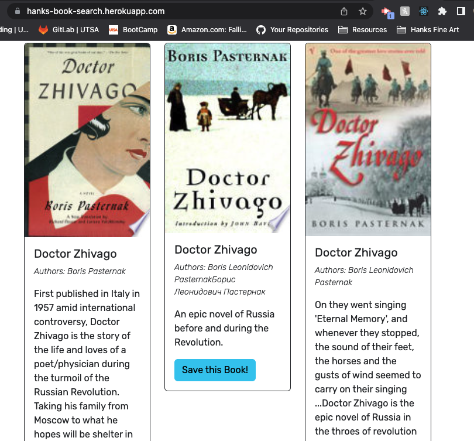
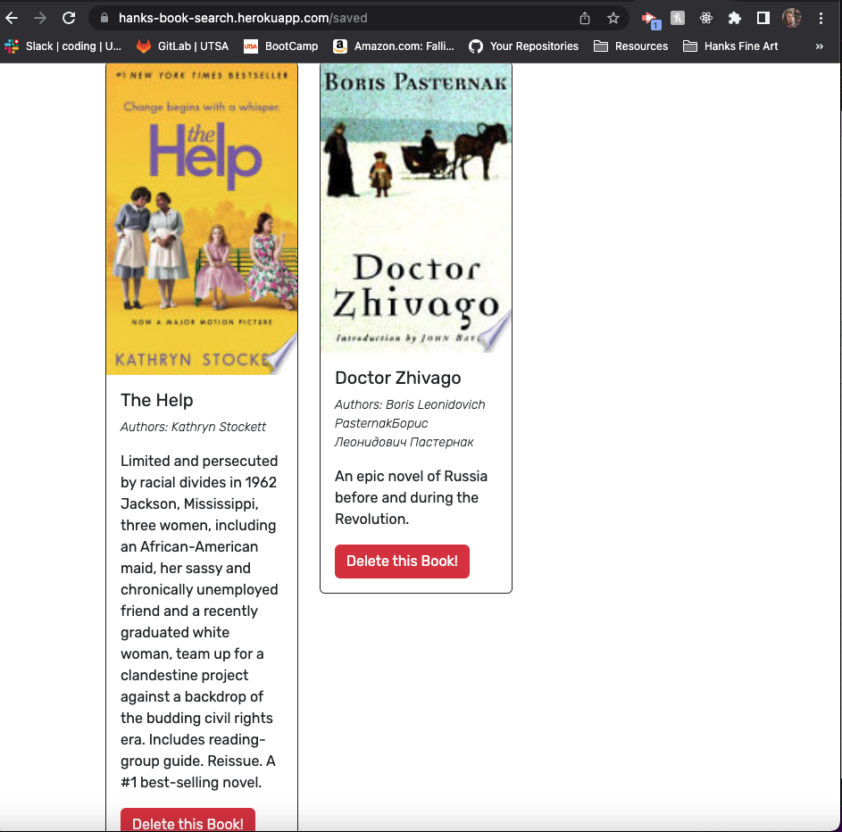
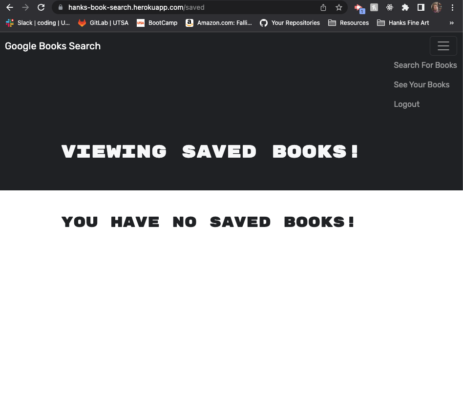
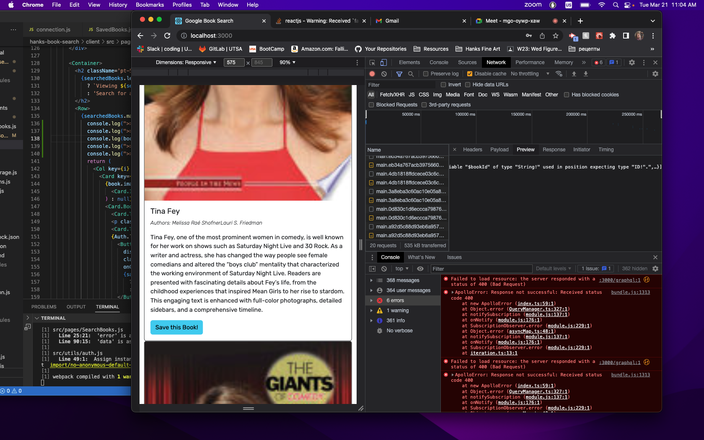
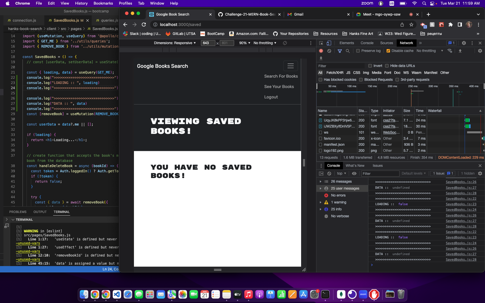

# wk21 - Hanks Book Search

## Description
The purpose of this project is to take starter code with a fully functioning Google Books API search engine built with a RESTful API, and refactor it to be a GraphQL API built with Apollo Server. The app was initially built using the MERN stack with a React front end, MongoDB database, and Node.js/Express.js server and API. It's already set up to allow users to save book searches to the back end. 

To complete the assignment, do the following:

1. Set up an Apollo Server to use GraphQL queries and mutations to fetch and modify data, replacing the existing RESTful API.

2. Modify the existing authentication middleware so that it works in the context of a GraphQL API.

3. Create an Apollo Provider so that requests can communicate with an Apollo Server.

Some frustrating things to note...one must connect the Heroku app with MongoDB through MongoDB Atlas. A tutorial for this is listed in the Credits links at the end of the ReadME.


## Acceptance Criteria

```md
GIVEN a book search engine
WHEN I load the search engine
THEN I am presented with a menu with the options Search for Books and Login/Signup and an input field to search for books and a submit button
WHEN I click on the Search for Books menu option
THEN I am presented with an input field to search for books and a submit button
WHEN I am not logged in and enter a search term in the input field and click the submit button
THEN I am presented with several search results, each featuring a book’s title, author, description, image, and a link to that book on the Google Books site
WHEN I click on the Login/Signup menu option
THEN a modal appears on the screen with a toggle between the option to log in or sign up
WHEN the toggle is set to Signup
THEN I am presented with three inputs for a username, an email address, and a password, and a signup button
WHEN the toggle is set to Login
THEN I am presented with two inputs for an email address and a password and login button
WHEN I enter a valid email address and create a password and click on the signup button
THEN my user account is created and I am logged in to the site
WHEN I enter my account’s email address and password and click on the login button
THEN I the modal closes and I am logged in to the site
WHEN I am logged in to the site
THEN the menu options change to Search for Books, an option to see my saved books, and Logout
WHEN I am logged in and enter a search term in the input field and click the submit button
THEN I am presented with several search results, each featuring a book’s title, author, description, image, and a link to that book on the Google Books site and a button to save a book to my account
WHEN I click on the Save button on a book
THEN that book’s information is saved to my account
WHEN I click on the option to see my saved books
THEN I am presented with all of the books I have saved to my account, each featuring the book’s title, author, description, image, and a link to that book on the Google Books site and a button to remove a book from my account
WHEN I click on the Remove button on a book
THEN that book is deleted from my saved books list
WHEN I click on the Logout button
THEN I am logged out of the site and presented with a menu with the options Search for Books and Login/Signup and an input field to search for books and a submit button  
```

### App Screenshots
The following are screenshots of the app running when a user is logged in. User searches for a topic, etc. in the search bar and results are loaded. When a book is selected, the save button is unclickable and tells user the book is already saved. When user goes to the saved books page, that book is now shown. Books can be deleted from the user's saved books page by clicking the delete button.











### Debugging Screenshots

There were a few errors in the apollo client that I could not figure out. For example, no keys in the jsx code, or checking to see if data or map existed before running the jsx code. Those and other issues with the ApolloClient were discovered by checking the network tab and toggling between header, preview, payload, etc.; and placing console.log in the predicted problem areas in the code. Here is a before and after situation when the books would not save to the user name.






## Installation

To run the code, from the root folder:

- npm i concurrency
- npm run install
- npm run develop

This code is deployed via Heroku

## Usage

Open the webpage using the [live URL link](https://hanks-book-search.herokuapp.com/)


## Credits

Resources used:
1) Bootcamp 21-MERN Activities
2) [MongoParseError: options useCreateIndex, useFindAndModify are not supported](https://stackoverflow.com/questions/68958221/mongoparseerror-options-usecreateindex-usefindandmodify-are-not-supported)
3) [TypeError: Cannot read properties of undefined (reading 'length') unhandledRejection](https://stackoverflow.com/questions/75480020/typeerror-cannot-read-properties-of-undefined-reading-length-unhandledrejec)
4) [TypeError: Cannot read properties of undefined (reading 'map')](https://stackoverflow.com/questions/69080597/%c3%97-typeerror-cannot-read-properties-of-undefined-reading-map)
5) [Set Up MongoDB Atlas](https://coding-boot-camp.github.io/full-stack/mongodb/how-to-set-up-mongodb-atlas)
6) [Deploy with Heroku and MongoDB Atlas](https://coding-boot-camp.github.io/full-stack/mongodb/deploy-with-heroku-and-mongodb-atlas)


## License

Please refer to the LICENSE in the repository.
